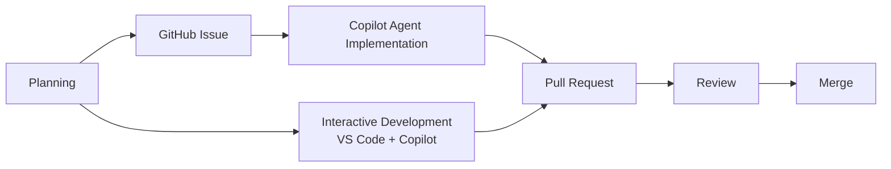
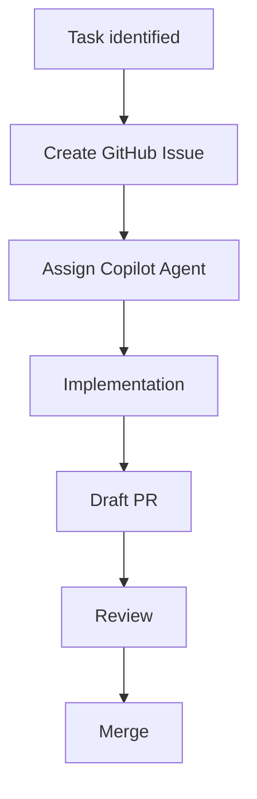
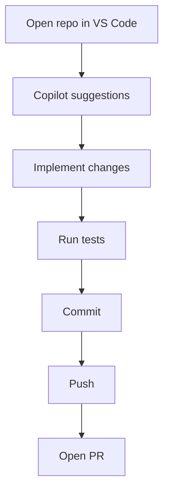

# GitHub Copilot Development Workflow

_Last updated: March 7, 2026_

This document describes an AI-assisted development workflow built around **[GitHub Copilot](https://github.com/features/copilot)** and GitHub-native tooling.

The workflow follows a simple **agentic development loop**:

```
Plan → Implement → Validate → Iterate
```

At a high level:



GitHub Issues act as the orchestration layer for AI-assisted development, while pull requests provide validation and collaboration.

## Accounts

This workflow assumes access to a **[GitHub Copilot](https://github.com/features/copilot)** subscription.

This enables:

- Copilot coding agents
- Copilot Chat
- Copilot code completion
- GitHub-native agent workflows

## Tools

| Tool | Role |
|-----|-----|
| [GitHub](https://github.com) | Issues, pull requests, and collaboration |
| [GitHub Copilot](https://github.com/features/copilot) | Planning assistance, code generation, and coding agents |
| [Visual Studio Code](https://code.visualstudio.com) | Primary development environment |

Copilot functionality in **[Visual Studio Code](https://code.visualstudio.com)** is provided through the **[GitHub Copilot extension](https://marketplace.visualstudio.com/items?itemName=GitHub.copilot)**.

## Development Workflow

Development occurs in two phases:

- **Planning**
- **Development**

## Phase 1 — Planning

Planning is performed using **Copilot Chat in VS Code or GitHub** so the AI has repository context.

Typical process:

1. Draft a task specification using the planning prompt template:  
   [AI development task template](../prompts/ai-development-task-template.md)

2. Use Copilot Chat to refine the task.

3. Create a GitHub Issue describing the task.

Issues serve as structured prompts for coding agents.

### Recommended Issue Structure

Issues intended for coding agents should follow this structure:

```
Objective
Relevant Files
Constraints
Implementation Notes
Acceptance Criteria
```

Clear issue specifications improve agent reliability and reduce iteration cycles.

## Phase 2 — Development

Implementation occurs through two complementary workflows.

### Agent-Driven Development

For well-scoped tasks:

1. Create a GitHub Issue.
2. Assign the issue to a **GitHub Copilot coding agent**.
3. The agent analyzes the repository and implements a solution.
4. The agent opens a **draft pull request**.
5. Review and iterate through PR comments.
6. Merge once validated.

Pull requests generated by agents must pass repository tests and CI checks before merging.



### Interactive Development

For day-to-day development:

1. Open the repository in **[Visual Studio Code](https://code.visualstudio.com)**.
2. Use Copilot suggestions for implementation.
3. Run tests locally.
4. Commit and push changes.
5. Open a pull request.



## Agent Task Guidelines

When creating issues for Copilot coding agents:

- Prefer **well-scoped tasks**
- Identify **relevant files or modules**
- Define **clear acceptance criteria**
- Avoid large architectural redesigns
- Prefer **incremental improvements**
- Ensure the repository builds and tests pass before assigning tasks

## Design Principles

- GitHub Issues are the source of truth for AI tasks
- AI agents should produce **small, reviewable diffs**
- Humans remain responsible for architecture and design decisions
- Pull requests provide validation, traceability, and collaboration

This workflow enables structured AI-assisted development while maintaining strong human oversight.
