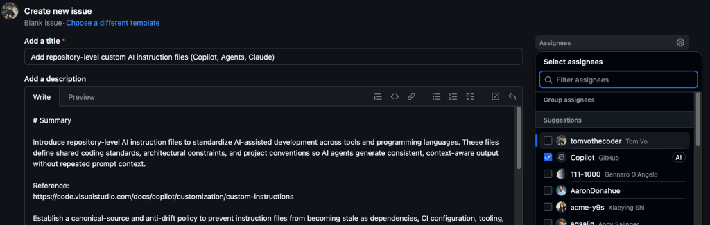

# Template: AI Instructions for GitHub Repositories

## Overview

This template is useful for adding AI-assisted development into repositories by introducing:

### 1. A canonical governance file: `AGENTS.md` (single source of truth)

`AGENTS.md` defines architectural rules, coding standards, testing philosophy, and dependency policy at a structural (not version) level.

### 2. Lightweight, tool-specific instruction files: `.github/copilot-instructions.md`, `.claude/CLAUDE.md`

Tool-specific files are lightweight enforcement layers:

- Concise and behavioral
- Derived from `AGENTS.md`
- Free of version numbers and volatile configuration
- Stable even as dependencies, compilers, or CI change

The model is language-agnostic and applies across Python, C++, and other ecosystems.

## How to Use

### 1. Create an Issue in Your Repo and Assign to Copilot

Open a new GitHub issue using the [Issue Template](#issue-template) provided at the bottom of this document.

- Example title: `Add repository-level custom AI instruction files (Copilot, Agents, Claude)`
- Recommended model: Any advanced model (e.g., Claude Opus, GPT Codex)

### 2. Review Related Pull Request and Refine (as needed)

Refine with Copilot until:

- Architectural constraints are clear
- Anti-hallucination rules are strong
- Policies are language-agnostic
- Tool-specific files contain necessary workflow-specific guardrails
  (e.g., PR/diff scope constraints for Copilot, multi-file edit and refactor limits for Claude)

Example pull request: https://github.com/E3SM-Project/e3sm_diags/pull/1039

### 3. Merge

Commit and merge once satisfied.

Future architectural changes update `AGENTS.md`.
Tool-specific files should not require edits for dependency or CI version changes.

---

## Issue Template

1. [AGENT_SETUP_PROMPT.md](https://github.com/aims-group/llnl-climate-ai/blob/main/docs/agentic-ai/AGENT_SETUP_PROMPT.md)
2. [AGENT_SETUP_WITH_WORKFLOWS_PROMPT.md](https://github.com/aims-group/llnl-climate-ai/blob/main/docs/agentic-ai/AGENT_SETUP_WITH_WORKFLOWS_PROMPT.md) -- includes planning and implementation templates that agents will to plan and implement complex work (e.g,. large scale refactoring). 

