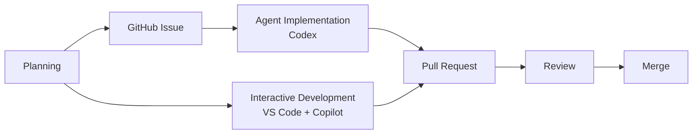
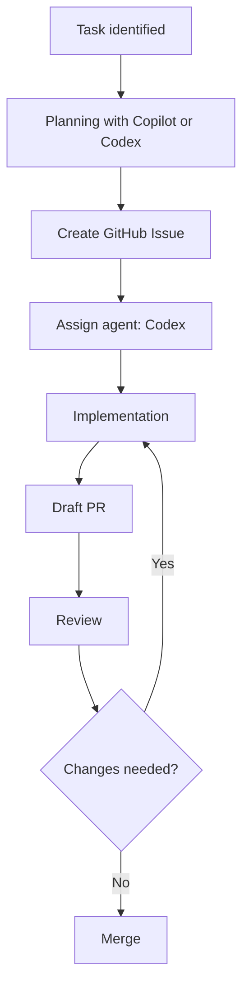
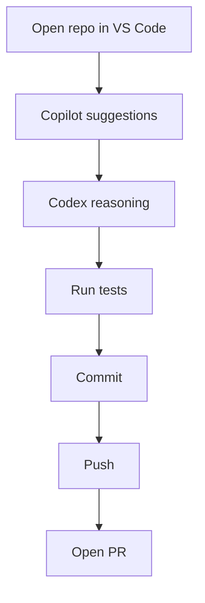

# AI Coding Workflow (Tom Vo)

_Last updated: March 7, 2026_

This document describes my AI-assisted software development workflow using **[GitHub Copilot](https://github.com/features/copilot)** and **[Codex](https://openai.com/codex)** agents.

The workflow follows the standard **agentic development loop**:

```
Plan → Implement → Validate → Iterate
```

At a high level, development follows this flow:



This loop is implemented using:

- **GitHub Issues** for planning and orchestration  
- **Codex agents** for autonomous implementation  
- **VS Code with Copilot and Codex** for interactive development  
- **Pull requests** for validation and iteration  

This structure ensures **reproducibility, traceability, and reviewability** of AI-generated changes.

## Accounts

This workflow uses two accounts:

- **[GitHub Copilot Business](https://github.com/features/copilot/copilot-business)** — organization account  
- **[Codex](https://openai.com/codex)** — personal account  

The **Copilot Business account** enables GitHub coding agents and Copilot features within organization repositories.

Most interactive development tasks are performed using **my personal Codex account**.

## Workflow

The development workflow is divided into two phases:

- **Phase 1 — Planning**
- **Phase 2 — Execution**

Planning defines the task and creates a structured issue. Execution implements the task either through autonomous coding agents or interactive development.

## Phase 1 — Planning

Planning is performed using **Copilot Chat or Codex with repository context** rather than general chat interfaces like ChatGPT.

Because these tools have access to the workspace and repository structure, they can directly analyze the codebase and:

- analyze repository files and APIs  
- identify relevant modules  
- follow repository conventions  
- generate task specifications grounded in the actual codebase  

This significantly improves planning accuracy compared to prompts generated without repository context.

### Tools

| Tool | Purpose |
|-----|-----|
| [GitHub Copilot](https://github.com/features/copilot) | Planning assistance and prompt generation |
| [GitHub Codex VS Code Extension](https://marketplace.visualstudio.com/items?itemName=openai.chatgpt) | Repository analysis, reasoning, and task refinement |
| [Codex App](https://openai.com/codex) | Workspace for planning complex tasks and reasoning |
| [GitHub](https://github.com) | Creating and managing issues |

### Planning Process

Planning typically follows this sequence:

1. **Create an initial task skeleton manually** using the template in  
   [docs/prompts/ai-development-task-template.md](https://github.com/aims-group/llnl-climate-ai/blob/main/docs/prompts/ai-development-task-template.md)
2. **Use Copilot Chat or Codex to refine the task specification** in planning mode.
3. **Review and correct the generated specification** to ensure it reflects the repository architecture and constraints.
4. **Create the GitHub Issue** using the refined task description.

A short human-written skeleton significantly improves AI planning quality and reduces incorrect assumptions about the repository.

### Example Planning Dialogue

Example interaction inside **VS Code Copilot Chat or Codex**.

**Developer**

```
Planning mode. Do not write code.

Use the prompt template in:
docs/prompts/ai-development-task-template.md

Create a GitHub Issue specification for the following task.

Task:
Add lazy loading support to the dataset loader to reduce memory usage.

Relevant files:
dataset_loader.py
dataset.py
```

**Copilot / Codex**

```
GitHub Issue Draft

Title
Add lazy loading support to dataset loader

Objective
Implement lazy loading to reduce memory usage when loading large datasets.

Relevant Files
- dataset_loader.py
- dataset.py

Requirements
- preserve existing public API
- avoid introducing new dependencies
- maintain compatibility with current workflows

Implementation Notes
- replace eager dataset loading with iterator-based loading
- ensure datasets load only when accessed

Acceptance Criteria
- existing tests pass
- lazy loading verified by unit tests
- memory usage reduced for large datasets
```

The generated specification becomes a **GitHub Issue**.

## Phase 2 — Execution

Execution occurs through two complementary workflows depending on task complexity.

### Tools

| Tool | Purpose |
|-----|-----|
| [Codex](https://openai.com/codex) | Autonomous implementation of GitHub issues |
| [Visual Studio Code](https://code.visualstudio.com) | Primary development environment |
| [GitHub Copilot](https://github.com/features/copilot) | Inline code completion and coding assistance |
| [GitHub Copilot VS Code Extension](https://marketplace.visualstudio.com/items?itemName=GitHub.copilot) | Code generation and development support |
| [GitHub Codex VS Code Extension](https://marketplace.visualstudio.com/items?itemName=openai.chatgpt) | Multi-file reasoning, debugging, and refactoring |
| [GitHub](https://github.com) | Pull requests, reviews, and collaboration |

### Workflow 1 — AI Task Orchestration via GitHub Issues

For larger tasks, I use **GitHub Issues** as the orchestration layer.

Issues act as structured task specifications that AI agents can execute.

#### Issue Structure

Typical issue structure:

```
Objective
Relevant Files
Constraints
Implementation Notes
Acceptance Criteria
```

#### Process

1. Identify a task or improvement.
2. Generate a structured issue prompt using **Copilot Chat or Codex**.
3. Create a GitHub Issue.
4. Assign the issue to a **Codex agent** on GitHub.
5. The agent analyzes the repository and implements a solution.
6. The agent opens a draft pull request.
7. Review and iterate through PR comments.
8. Merge once validated.

#### Diagram



### Workflow 2 — Agent-Assisted Development in VS Code

For day-to-day development, I work locally in **[Visual Studio Code](https://code.visualstudio.com)**.

#### Typical Usage

**GitHub Copilot**

Used for:

- inline code completion  
- small function implementations  
- boilerplate generation  
- writing tests  
- generating commit messages  

**Codex**

Used for:

- debugging complex issues  
- multi-file edits  
- architectural reasoning  
- structured refactoring  

#### Process

1. Open repository in VS Code.
2. Implement code using Copilot suggestions.
3. Use Codex for complex tasks such as debugging or refactoring.
4. Run tests locally.
5. Commit changes.
6. Push to GitHub and open a pull request.

#### Diagram



## Example Task

Example task following this workflow.

**Issue:** Add lazy loading to dataset loader

1. Create a GitHub Issue describing the objective, relevant files, and constraints.
2. Assign the issue to a **Codex agent**.
3. The agent analyzes the repository and opens a draft pull request.
4. Review the pull request and request modifications if necessary.
5. Merge once tests pass and the implementation is validated.

## Design Principles

- **Planning should be performed using tools with repository context**
- **GitHub Issues are the source of truth for AI tasks**
- **AI agents should produce minimal, reviewable diffs**
- **Humans remain responsible for architecture and design decisions**
- **Pull requests provide validation, traceability, and collaboration**

## Summary

| Stage | Tool |
|------|------|
| Planning | Copilot + Codex |
| Implementation | Codex agents |
| Interactive coding | Copilot + Codex in VS Code |
| Validation | Tests and pull requests |
| Iteration | PR review and agent updates |

This workflow enables:

- reproducible AI-assisted development  
- structured planning and execution  
- clear human oversight through pull requests  
- efficient collaboration between developers and AI agents
